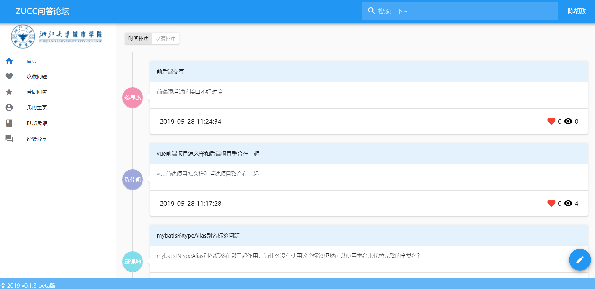
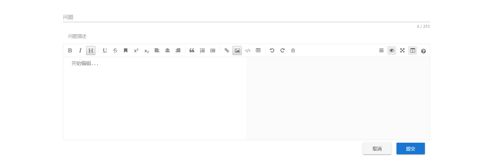
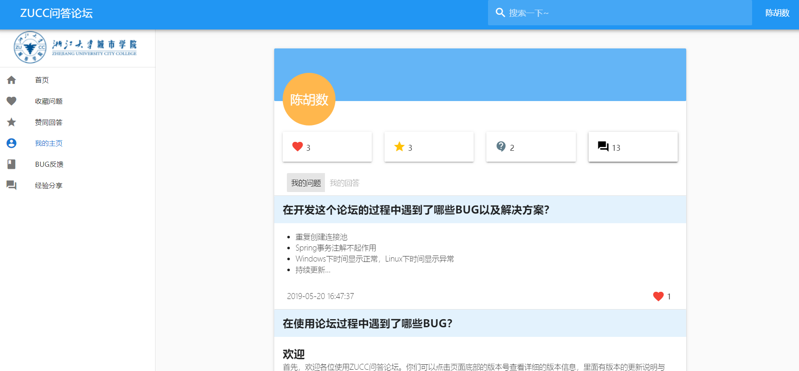

# ZUCC问答论坛

[]()[]()

后端消息推送与搜索服务开源地址：[EMS-Message-push](https://github.com/lychs1998/EMS-Message-push)
后端SSM开源地址：[QA-back-end](https://github.com/Stanph/back-end)

## 项目简介

核心功能为课堂问答，学生和老师可以在此提问与回答。

前端实现全局响应式，遵循Material Design设计规范，页面分为：首页、搜索、个人主页、问题详情页、收藏页、版本信息。

使用Mysql做持久化处理，利用Mysql binlog将数据同步到ElasticSearch，ElatsicSearch提供搜索功能。在监听到回答表insert事件时，判断用户socket.io是否保持连接，如果连接向前端推送未读消息，反之，则存储进es中，等待用户上线时推送。

## 项目结构图


## 功能特性

- 实现首页问题列表动态加载
- 实现登录/注销功能
- 实现Markdown编辑与渲染
- 实现提问与回答功能
- 实现问题详情页的渲染
- 实现token鉴权、存储与过期
- 实现修改密码功能
- 实现UI全局响应式，遵循Material Design设计规范
- 实现收藏、点赞与访问统计功能
- 实现编辑器图片上传功能
- 实现Markdown编辑器在手机端与电脑端自适应
- 实现用户主页，可点击用户头像进入他人主页
- 实现基于ElasticSearch的搜索功能
- 实现问题有新的回答时的实时推送(基于Socket.io)
- 使用路由守卫在转跳前判断用户权限，如果没有登录，则转跳到登录页面。

## 前端

使用UI组件库：Vuetify

前端页面Github开源地址：https://github.com/lychs1998/QA-bbs-front

### 开发环境依赖

- Node.js

### 项目部署

安装Node.js后使用npm安装@vue/cli

```bash
npm install @vue/cli -g

//如果官方源速度过慢，建议更换npm源为国内淘宝源
npm config set registry https://registry.npm.taobao.org
```

运行项目

```bash
git clone https://github.com/lychs1998/QA-bbs-front.git
cd QA-bbs-front
npm install

//命令行运行前端页面
npm run serve
```

使用vue cli 3.x版本的UI界面运行项目

```bash
vue ui
```

浏览器访问`http://localhost:8000`打开Vue CLI的可视化管理界面，点击导入，选择git clone下的文档。导入后，点击`任务-serve-运行`即可。其它操作参考Vue CLI官方文档。

### 目录结构与介绍

#### 目录结构

* src
  * App.vue：网页前端总框架
  * main.js：导入依赖、路由守卫、全局初始化Axios与Socket.io
  * store.js：预设初始数据
  * router.js：路由设置与页面传值设置，预制了面包屑导航数据以及是否需要登录的配置
  * views
    * Index.vue：首页
    * Home.vue：他人主页
    * Question.vue：问题详情页
    * Me.vue：个人主页
    * Star.vue：支持的回答
    * changePwd.vue：修改密码
    * Search.vue：搜索结果页面
    * Release.vue：版本介绍
    * Login.vue：登录界面
    * 404.vue：404界面，防止跳出单页应用外
    * Favorite.vue：收藏问题页面
* vue.config.js：配置文档，在build时所有的静态资源前会加上baseurl，如果baseurl为空，则默认从`/`访问资源。
#### 页面介绍

* App.vue：网页布局实现

  使用组件：vue-snotify、v-list、v-toolbar、v-btn、v-footer、v-navigationDrawer、v-bottomSheet

  实现功能：初始化socket.io监听事件，并通过vue-snotify发送页面通知。侧边全局导航，底部提供版本信息入口，头部提供搜索与登录功能，根据是否登录显示不同的按钮。通过v-bottomSheet隐藏提问表单在底部，通过v-btn点击显示。实现注销功能。

  可参考内容：`$imgAdd(pos,$file)`方法实现了前端图片上传。

* Index.vue：首页

  使用组件：v-btnToggle、v-timeline、v-snackbar

  实现功能：首页问题显示，且按时间/收藏数排序

  可参考内容：JavaScript实现滚动加载更新数据

* Home.vue：他人主页

  使用组件：v-btnToggle、v-timeline、v-snackbar

  实现功能：通过$router传递被访问用户id，使用axios请求后端获取该用户的所有回答与所有提问。通过对数据的遍历，计算该用户获得的点赞数和收藏数，以及其提问与回答情况。

* Question.vue：问题详情页

  使用组件：v-snackbar、v-timeline

  实现功能：通过$router传递问题id，通过axios请求后端获得该问题及其全部回答。同时使用markdown编辑器。

* Me.vue：个人主页

  使用组件：v-btnToggle、v-timeline、v-snackbar

  实现功能：使用axios发送token请求后端获取自己的所有回答与所有提问。通过对数据的遍历，计算该用户获得的点赞数和收藏数，以及其提问与回答情况。

* Star.vue：支持的回答

  使用组件：v-snackbar、v-timeline

  实现功能：通过读取本地cookie存储的token，通过axios请求后端获取个人的收藏列表。

* changePwd.vue：修改密码

  实现功能：修改密码

* Search.vue：搜索结果页面

  使用组件：通过$router传递搜索内容，通过axios请求node服务器，使用elasticsearch查询所有的问题和回答。

* Login.vue：登录界面

  实现功能：登录，发送userid和password到后端，后端返回token,将token存储在前端cookie中，并设置1天过期。

* 404.vue：404界面，防止跳出单页应用外

  使用组件：无

* Favorite.vue：收藏问题页面

  使用组件：v-snackbar、v-timeline

  实现功能：通过读取本地cookie存储的token，通过axios请求后端获取个人的收藏列表。

#### 其它介绍

socket.io的全局初始化、登录与事件监听：

```javascript
/*客户端*/
//main.js初始化
import SocketIO from 'socket.io-client'
var socket=SocketIO('http://localhost:2333/socket.io');
Vue.prototype.$socket = socket;

//App.vue
//移除所有监听事件，避免重复监听
this.$socket.removeAllListeners()
//传递token建立连接
this.$socket.emit('login',String(this.$cookie.get('token')));
//收到消息时弹窗提醒
this.$socket.on('reply',function(msg) {
    console.log(msg);
    if(msg.length>0){
        msg.forEach(data => {
            this.newSnotify(data);
        });
    }
}.bind(this))
```

Axios的全局初始化：

```javascript
Axios.defaults.baseURL = 'api';
Axios.defaults.headers.post['Content-Type'] = 'application/json';
Vue.prototype.$axios = Axios;
```

路由守卫的实现：

```javascript
//路由守卫的实现
router.beforeEach((to, from, next) => {
    if(to.meta.needLogin){
        if(Vue.prototype.$cookie.get('token')!==null){
            next();
        }else{
            next('/login');
        }
    }else{
        if(to.meta.login&&Vue.prototype.$cookie.get('token')!==null){
            next('/');
        }else{
            next();
        }
    }
})
```

### 页面展示

首页如下所示：


编辑器如下：


个人主页如下：


## 历史版本

##### v0.1.3 Beta版本

- 增加搜索功能
- 修复与优化滚动加载判定
- 自己的问题有新的回答会有实时推送

##### v0.1.2 Beta版本

- 添加用户主页，可点击用户头像进入他人主页
- 后端重构，修复重复创建连接池的错误
- 首页可以按收藏数进行排序了
- 修复时间显示异常的问题
- 优化修改密码和登录的交互体验
- 侧边栏添加开发经验分享和BUG反馈快捷入口
- 修复了问题详情与问题详情间无法转跳的问题

##### v0.1.1 Beta版本

- 重构前端界面，实现全局响应式，遵循Material Design设计规范
- 添加收藏、点赞与访问统计功能
- 添加版本说明页面
- 添加返回按钮与面包屑导航
- 添加编辑器图片上传功能
- 优化Markdown编辑器在手机端的使用
- 部署至校内服务器测试

##### v0.1.0 Beta版本

- 实现首页问题列表动态加载
- 实现登录/注销功能
- 实现Markdown编辑与渲染
- 实现提问与回答功能
- 实现问题详情页的渲染
- 实现token鉴权、存储与过期
- 实现修改密码功能
